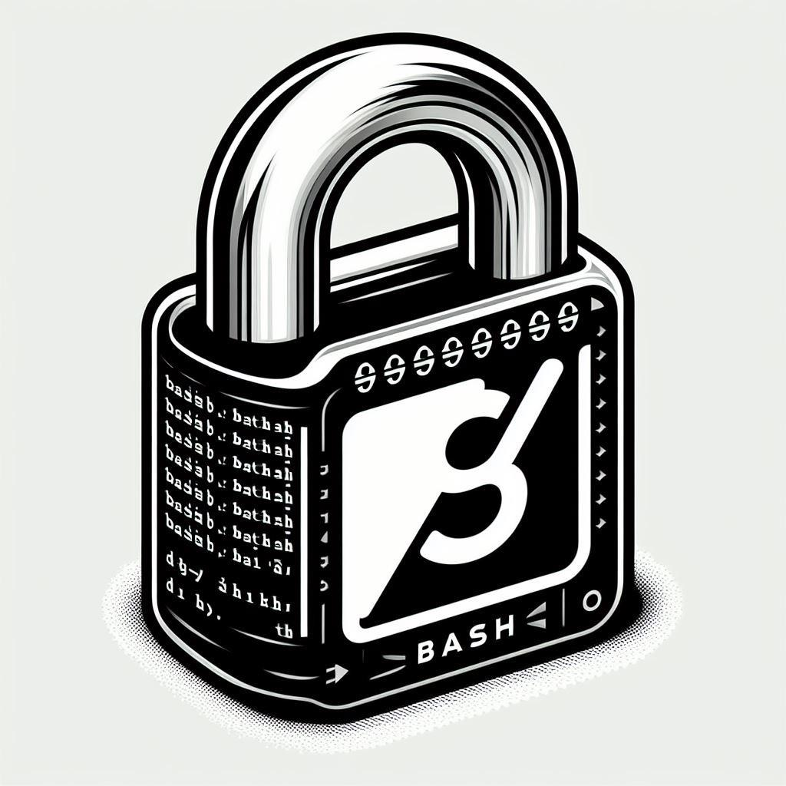

# Bash SSH Kicker. Network scanner
Bash Secuirty SSH Kicker is a BASH script designed to help you manage SSH sessions on your system. It allows you to perform tasks such as checking if SSH is enabled, performing an nslookup, and kicking users off the computer by terminating their SSH sessions.

## Features

- Check if SSH is enabled on the system.
- Perform an nslookup to query DNS information.
- Terminate SSH sessions associated with specific IP addresses.
- Ability to stop the SSH service if desired.

## Requirements

- bash
- Linux Operating System
- Mac Operating System

## Installation

1. Clone the repository:

    ```shell
    git clone https://github.com/WilSegale/BASH_SECURITY.git
    ```

2. Navigate to the project directory:

    ```bash
    cd BASH_SECURITY
    ```

3. Run the bash file for linux
    ```bash     
    sudo bash LinuxKick.py
    ```

4. Run the bash file for MacOS
    ```bash
    sudo bash MacOSKick.py
    ```

## Usage

1. Follow the prompts to select an action.
2. Depending on your choice, provide necessary inputs such as domain name or IP address.

## Contributing

Contributions are welcome! If you have any ideas for improvement or find any issues, feel free to open an issue or create a pull request.

## License

This project is licensed under the MIT License. See the [LICENSE](LICENSE) file for details.

